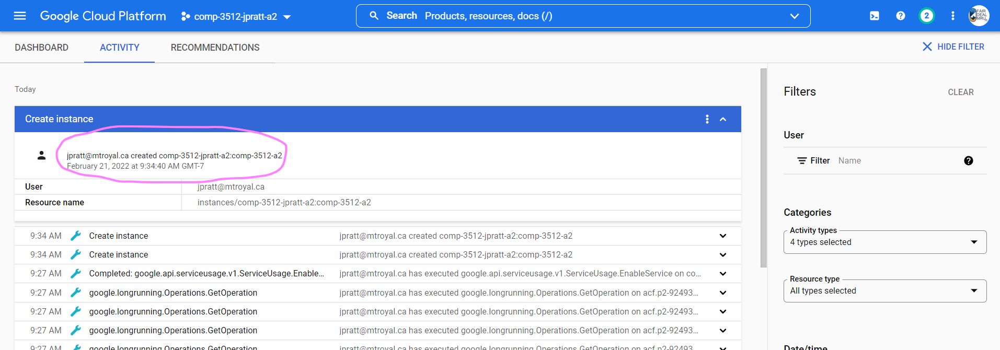
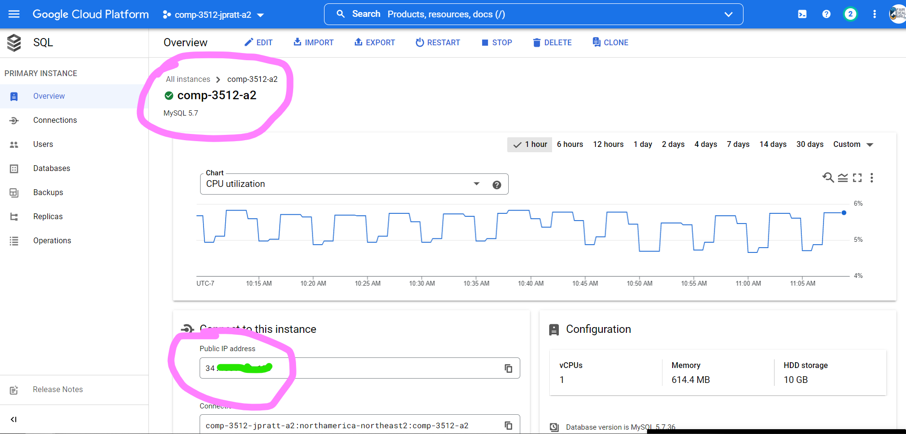
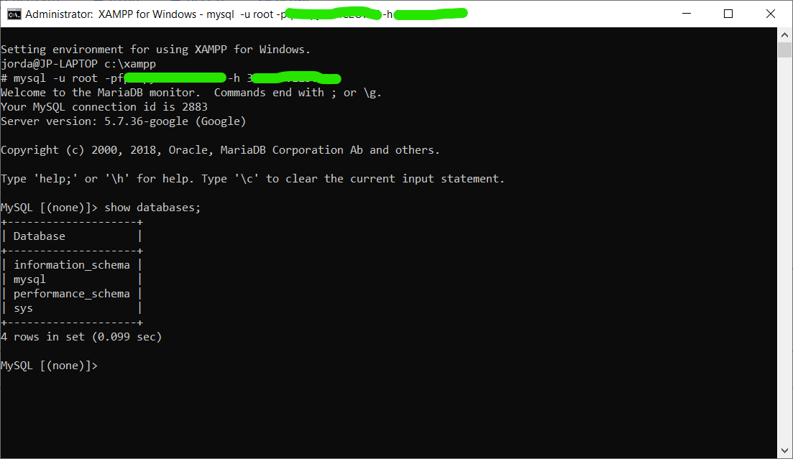

# Assignment 02 - Milestone 01

**Due March 9 (W) @ 9 PM**

**Worth 3% of your final grade**

**Content in this milestone document takes precedence over anything you read in the [assignment pdf](comp-3512-a2-v1.pdf).**

## Overview

This first milestone is primarily meant to get the "plumbing" in place for the assignment. That is, you'll be setting up:

- your GitHub repo, 
- a Heroku site attached to that repo, and
- a Google Cloud Platform mySQL server (used from milestone 3 onward)

You'll also be using your plumbing a bit to:

- create a very simple PHP "test" page and getting it up on Heroku 
- connect to your mySQL server from the command line (just to make sure you can)

## The Starting Repository

Accept the starting repo here: https://classroom.github.com/a/1U1hgs5Y

## Your Mark

I've modified marking to make it less punishing.  

### Oops Policy

If you make a simple mistake at Level 1 or 2, the standard Oops Policy is in effect: you'll get an opportunity to fix ONE oops.

### The Ladder

| Completed Req's Sections | Corresponding % |
| :----------------------: | :-------------: |
|           None           |       0%        |
|         Level 1          |       25%       |
|         Level 2          |       65%       |
|         Level 3          |       78%       |
|         Level 4          |       98%       |

## The Requirements Sections

### Level 1 (25%)

#### Requirements

All of the following need to be complete for you to reach Level 1:

- [ ] [L1.1] You've accepted the starting repo from GitHub Classroom.

- [ ] [L1.2] You have sent me an email that clearly states who you want to work with (if possible) as well as who you **don't** want to work with. If you don't care one way or the other, let me know that. These restrictions are in effect:
  - You **cannot** work with someone you worked with on assignment 1.
  - Teams will have 3 or 4 members.

  _You will be working in teams from milestone 2 onward. I will let you know what the teams are on Thursday, March 10._

---

### Level 2 (65%)

#### Prerequisites

- You have set up XAMPP on your own device and/or are using a computer in B103, B107, B162, or E203. See the [setup doc available in the Quick Links](https://github.com/MRU-CSIS-3512-202201-001/xampp-setup).
- You know how to set up a Heroku server and push code from GitHub to it, or have watched the [getting yer stuffs on Heroku](https://youtu.be/r_Ft9TnUTkQ) [29:36] screencast.
  - UPDATED [2022-03-04] Things are easier now: [watch the new walkthrough](https://watch.screencastify.com/v/mosGzDZfUroihFovmSZI) [3:21] AND [this additional screencast, too](https://watch.screencastify.com/v/gF7fH7nHKfgDg8cImQ04) [2:10].
- You know how to use a Procfile to keep some things hidden on Heroku, or have watched the first 4 minutes of the [configuring your projects for use on XAMPP and Heroku](https://youtu.be/YNljMRhRkAA) screencast.

#### Requirements

To reach Level 2, you must have completed all the Level 1 requirements and have also completed all of these, too:

- [ ] [L2.1] Your repo has a `composer.json` file with the contents shown in the "configuring your projects" screencast.

- [ ] [L2.2] Your repo has a `Procfile` with the contents shown in the "configuring your projects" screencast.

- [ ] [L2.3] Your repo has a `public` directory, with a single file in it: `index.php`.

- [ ] [L2.4] There is a working URL in the starting repo's `README.md` to the `index.php` file on Heroku.

- [ ] [L2.5] When you click on the link in the README, you arrive on a page that displays the message "It's alive!". This message must be in an `<h1>` tag generated using PHP. 

- [ ] [L2.6]  When the URL given in the README is validated by the [W3C Markup Validation Service](https://validator.w3.org/), no errors are present.

---

### Level 3 (78%)

#### Prerequisites

- You have claimed your Google credits. (I believe all of you completed this in assignment 1, but if you didn't, make sure you go back and get that done.)
  
- You know how to set up a mySQL server on GCP or have watched the following screencasts:
  - [creating a GCP project](https://youtu.be/0OSHSaeetwA) [3:32]
  - [overview of what we're trying to do with GCP](https://youtu.be/I3DbbhabyN0) [4:30]
  - [creating a mySQL instance on GCP](https://youtu.be/EF--K_Kmovc) [8:52]

  _I made these last semester, so when you need to choose names for things, just choose ones that make sense for the current semester. For example, when choosing the instance ID (in the "creating a mySQL instance on GCP" screencast around the 8:18 mark), use `comp-3512-asg2` or something similar._

#### Requirements

To reach Level 3, you must have completed all the Level 2 requirements and have also completed all of these, too:

- [ ] [L3.1] You have a reasonably-named screenshot in your repo that shows that your mySQL instance has been created. This screenshot must be taken from the Activity area of your project and must show the details of the most recent `Create instance` entry. Here is an example screencast for my instance:

  

  _I went to the Activity panel and toggled open the most recent `Create instance` entry. Notice how it clearly shows my email, the name of my project (`comp-3512-jpratt-a2`), and the name of my mySQL instance (`comp-3512-a2`)._

- [ ] [L3.2] You have a reasonably-named screenshot in your repo that shows the Overview page for your mySQL instance. This screenshot must show a matching instance name (`comp-3512-a2` in this case), along with the public IP address of your instance:

  

  _I've obfuscated my IP address - DON'T do this for your screenshot!._

---

### Level 4 (98%)

#### Prerequisites

- You know how to connect to a GCP mySQL instance from the command line, or have watched the [connecting to our GCP server via the mySQL client](https://youtu.be/H_5_1yQO_1U) [16:30] screencast.

#### Requirements

To reach Level 4, you must have completed all the Level 3 requirements and have also completed the following one, too:
 
 - [ ] [L4.1] You have a reasonably-named screenshot in your repo that shows you have successfully connected to your GCP mySQL server and have shown the databases already present.

    

    _I've obfuscated my password and IP address...you can do the same for your PASSWORD, but DON'T hide your IP address!_

**IMPORTANT**
After doing this step, I would strongly suggest stopping your mySQL instance until milestone 3, just to make sure you don't use any credits.
