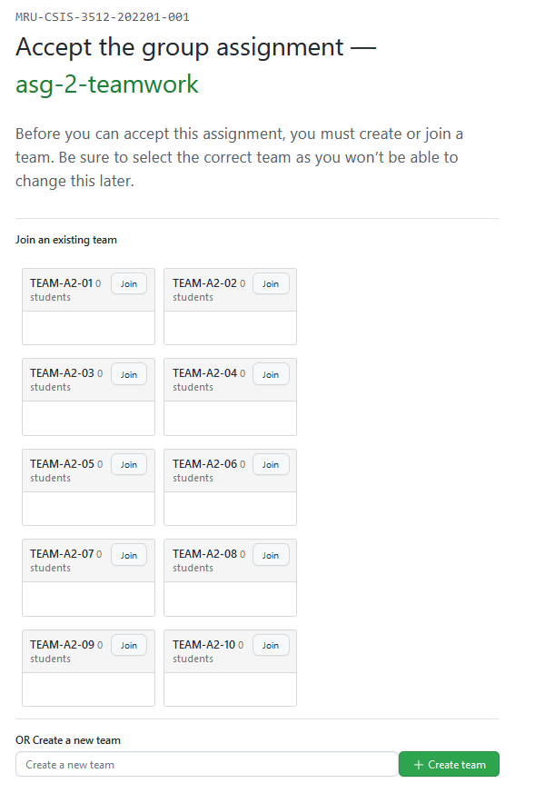

# Assignment 02 - Milestone 02

**Due March 16 (W) @ 9 PM**

**Worth 3% of your final grade**

**Content in this milestone document takes precedence over anything you read in the [assignment pdf](comp-3512-a2-v1.pdf).**

## Overview

This second milestone will have you creating 3 of the pages that make up the finished site:

1. Home (Not Logged-In Version)
2. Login
3. About

In addition, the site has a navigation Header that displays in "hamburger style" at Mobile L size.

## The Starting Repository

As in milestone 3 of assignment 1, you'll be working in a team repository from this point onward.

The starting team repo is here: https://classroom.github.com/a/_FxZmykA

Like last time, you'll be asked to select a team:

**Join the team you were told you are on - it's shown in the [teamwork.md](teamwork.md) document. Please do NOT create a new team.**

Like last time, you all have admin privs on this repo.

## Your Mark

### Oops Policy

If you make a simple mistake at Level 0 through 3, a modified Oops Policy is in effect: the group gets an opportunity to fix TWO oopsies. (I think that's the plural of "oops".) 

### The Ladder

| Completed Req's Sections | Corresponding % |
| :----------------------: | :-------------: |
|  None, or only Level 0   |       0%        |
|         Level 1          |       25%       |
|         Level 2          |       55%       |
|         Level 3          |       65%       |
|         Level 4          |       78%       |
|         Level 5          |       98%       |

#### The Ladder Details

#### Level 0

If the following aren't met, I won't mark your submission. Most of these have been done previously, so as long as you haven't busted anything, there is no real work to do here!

The one exception is L0.4 - keep that HTML validating! (This is not just some busywork requirement - it truly does help you avoid a lot of wonky issues with your visual design.)

- [ ] [L0.1] The Feedback pull request in the repo has not been closed or merged.

- [ ] [L0.2] The name of your Heroku application is `comp-3512-w22-team-xx`, where `xx` is the 2 digits of your team.

- [ ] [L0.3] There is a working link in the team repo's `README.md` that takes you to the Heroku URL for your application; this should cause your `index.php` to be displayed.

- [ ] [L0.4]  When the Home, Login, and About pages are validated by the [W3C Markup Validation Service](https://validator.w3.org/), no errors are present.

    _Warnings are OK, though I do reserve the right to roll me eyes and sigh melodramatically._

---

#### Level 1 (25%)

To reach Level 1, you must have completed all the Level 0 requirements and also:

- [ ] [L1.1] The [Home Page Requirements](#the-home-page-not-logged-in-version) are all complete. 

---

#### Level 2 (55%)

To reach Level 2, you must have completed all the prior Level requirements and also:

- [ ] [L2.1] The [Login Page Requirements](#the-login-page) are all complete.

- [ ] [L2.2] The [Header Requirements](#the-header) are all complete.

---

#### Level 3 (75%)

To reach Level 3, you must have completed all the prior Level requirements and also:

- [ ] [L3.1] The [About Page Requirements](#the-about-page) are complete.

---

#### Level 4 (82%)

To reach Level 4, you must have completed all the prior Level requirements and also:

- [ ] [L4.1] The [Visual Design / Layout Requirements](#visual-design--layout) are complete. 

---

#### Level 5 (98%)

To reach Level 5, you must have completed all the prior Level requirements and also:

- [ ] [L5.1] The visual design and layout of the site shows that the visual design was given an impressive amount of care and attention.

---

## The Page Requirements

### The Home Page (Not Logged-In Version)
  
- [ ] [HOME.1] This page has a site-appropriate Hero image. This can be the same image as in assignment 1, or a different one.
  
- [ ] [HOME.2] This page has an obvious way to go to the Login page. 

    _This is in addition to the link in the Header!_

- [ ] [HOME.3] This page has an obvious way to join/register, but this functionality is not yet working.

- [ ] [HOME.4] This page has an obvious way to search for movies by title, but this functionality is not yet working.

---

### The Login Page
  
- [ ] [LOGIN.1] This page provides an obvious way to log in, but this functionality is not yet working.

- [ ] [LOGIN.2] This page has an obvious way to register for the site, but this functionality is not yet working.

    _Yes, this functionality is also available on the Home page._

---

### The About Page
  
- [ ] [ABOUT.1] This page contains all of the following information:
  - [ ] university
  - [ ] class name
  - [ ] semester w/ year
  - [ ] web technologies used
  - [ ] team members with working links to their GitHub profiles
  - [ ] working link to the assignment source code on GitHub

- [ ] [ABOUT.2] This page displays the current date and time in Alberta. PHP must be used to accomplish this.

- [ ] [ABOUT.3] This page displays how many days, hours, and minutes are left until milestone 5 is due (April 6 @ 9:00 PM). PHP must be used to accomplish this.

    _This is not a countdown timer - just how much time is remaining from the time this page was served up by the server._

---

### The Header

- [ ] [HEADER.1] The Header has a logo appropriate for the site theme.
  
- [ ] [HEADER.2] The Header has a navigation menu.

- [ ] [HEADER.3] The navigation menu is a "standard" menu at Laptop L size.

- [ ] [HEADER.4] The navigation menu is a "hamburger" menu at Mobile L size (see notes about this on page 2 of the [pdf](comp-3512-a2-v1.pdf)).

- [ ] [HEADER.5] The navigation menu contains working links to the Home, Login, and About pages.

---

### Visual Design / Layout

- [ ] [VISUAL.1] When viewed in Chrome's devtools at Laptop L size, all pages have a reasonable layout and visual design with no major issues.

- [ ] [VISUAL.2] When viewed in Chrome's devtools at Mobile L size, al pages have a reasonable layout and visual design with no major issues.